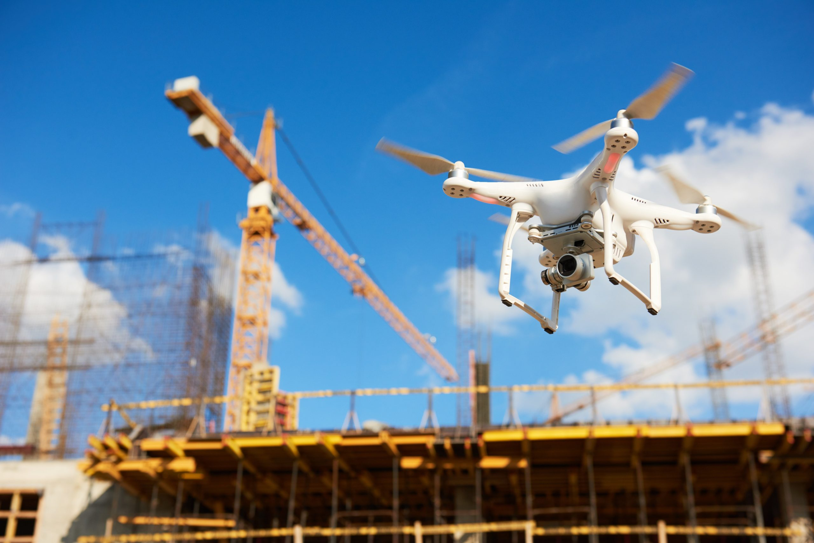

# IP Project 9th Edition - Team 3

Meet the Team:

- [Luca Rottiers](https://github.com/LucaRottiers)
- [Wout Depotter](https://github.com/Wout-Depotter)
- [Jesus Martinez](https://github.com/JESUMH)
- [Leon Paelinck](https://github.com/LeonPaelinck)

In the 9th edition of the yearly IP Project everything revolves around smart cities, more specifically smart technology in construction.

Using everything we learned in the introduction week and during the IP project about smart cities, BIM, digital twins, BMC, GDPR, IoT, API's and cybersecurity, we were able to come up with interesting ideas and work on a proof of concept for implementing those ideas in the real world.

Below are some links to the different ascpects of our project:

- [Business model canvas](business-model-canvas.docx)
- [Proof of concept](Smart-Construction-sites.pdf)
- [Documentation for the demo](Documentation.md)
- [Powerpoint presentation](PresentationIP.pdf)
